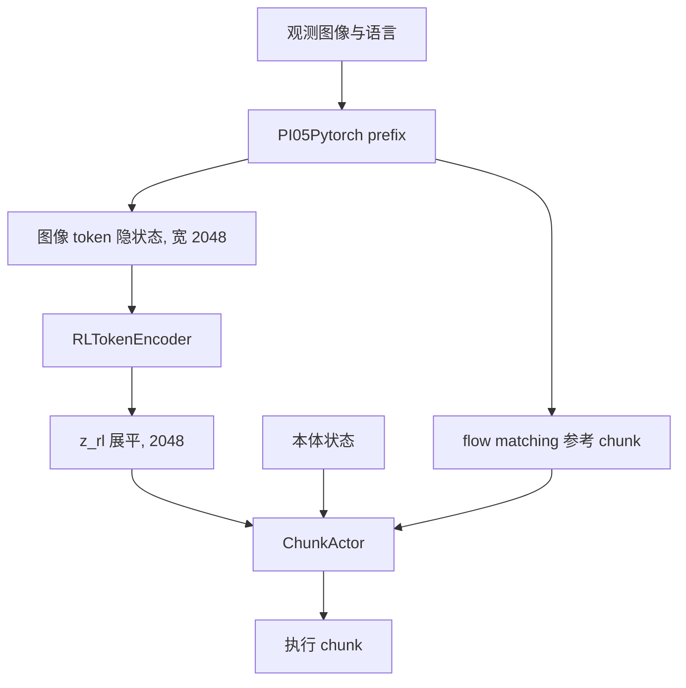

# RLToken on LeRobot π0.5 开发计划

本文是在 LeRobot 的 PyTorch π0.5 上实现完整 RLToken 方法的开发计划。方法定义以 `openpi-RLT` 为准：`openpi-RLT/questions.md` 描述训练、推理和在线闭环，`openpi-RLT/src/openpi/models/rl_token.py` 是 RL-token 编解码器。本文只规定要做什么、插在哪里、怎样验收。当前不改代码。

第一台具体机器人用 LeRobot 已有的 SO-100 / SO-101。动作维、相机数和控制频率做成配置，供以后换机器人时复用。

---

## 1. 目标与不做的事

### 1.1 目标

在 LeRobot π0.5 上复现 openpi 的完整 RLToken 流程，分成三段，顺序不能颠倒：

1. **Stage 1，离线。** 在示教数据上训练 RL-token。它把 π0.5 图像 prefix 的最终层隐状态压成少量 token，再重建回去。可选地用 `rlt_alpha` 同时继续训练 VLA 的 flow matching。
2. **Stage 2，在线。** 冻结 VLA 和 RL-token。用离线示教热身之后的真机 rollout，训练一个 chunk 级 actor 和 twin critic。actor 把 VLA 的参考动作改写成要执行的动作。
3. **推理闭环。** 一次观测同时给出 `z_rl` 和参考 chunk。只有关键阶段才把参考 chunk 交给 actor。

RLToken 不替换 π0.5。π0.5 仍然用 flow matching 生成参考动作 chunk。RL-token 不直接输出动作。在线修正是另一套小网络。



### 1.2 不做的事

- 不重写 π0.5 的 flow matching、SigLIP、Gemma expert 或 PaliGemma tokenizer。现有 `PI05Pytorch.forward` 和 `sample_actions` 的对外行为保持可用，供普通 π0.5 微调继续走原路径。
- 不把 LeRobot 现有的 HIL-SERL SAC、`GaussianActorPolicy` 或带图像的 `ReplayBuffer` 当成 RLToken 的算法本体。那些模块服务的是单步高斯策略和图像状态。RLToken 的样本里存的是已经算好的 `z_rl`，动作单位是一整段 chunk。
- 不在 Stage 2 更新 VLA 或 RL-token。在线学习只更新 actor、critic 和它们的 target 网络。
- 不引入 PPO clip、GAE 或行为策略的 importance weight。Stage 2 是固定标准差的 off-policy actor-critic。
- 不把 Agilex 的 7 维动作、20 Hz 或 ROS 话题写进 SO-ARM 路径。机器人边界走 LeRobot 的 `get_observation` / `send_action`。

---

## 2. openpi 方法摘要

本节只保留移植时必须对齐的定义。细节和代码位置见 `openpi-RLT/questions.md`。

### 2.1 VLA 与 RL-token 的分工

π0.5 把图像和语言（含离散化后的 state）编成 prefix，再用 action expert 以 flow matching 生成动作 chunk。prefix 过 Gemma 之后的最终层输出才是 RL-token 的输入，不是 SigLIP 的原始 patch embedding。

固定指令任务丢掉语言 token，只把图像 token 送给 RL-token。这是 openpi `extract_prefix_embeddings(..., image_only=True)` 和 `compute_loss_with_prefix(..., image_only=True)` 的行为。图像 token 在 prefix 的前部，语言 token 在后部。

RL-token 是一个轻量 encoder-decoder：

- Encoder 用可学习 query 对 prefix 隐状态做交叉注意力，压成 `num_rl_tokens` 个向量。
- Decoder 用长度为原序列的 query，从这些 token 重建 prefix。
- 重建目标 `stop_gradient`。这份 MSE 只训练 RL-token，不把梯度送回 VLA。
- 线上用的 `z_rl` 是 encoder 输出展平后的向量。decoder 只在 Stage 1 使用。

Ethernet 实验的超参，也是本计划的默认值：1 个 token、2 层、`embed_dim=2048`、`input_dim=2048`。`input_dim` 等于 Gemma 2B 的 hidden size。类定义里的 `embed_dim=512` 不是这条实验的取值。`z_rl` 的形状是 `[2048]`（1 × 2048 展平）。

`CrossAttentionLayer`（`openpi-RLT/src/openpi/models/utils/fsq_tokenizer.py`）每一层是：LayerNorm + 自注意力残差、LayerNorm + 交叉注意力残差、LayerNorm + GeGLU MLP 残差。query 和 key 的位置编码用正弦初始化，训练中作为参数更新。`num_heads=8`，`mlp_ratio=4`，`dropout_rate=0`。当 `input_dim != embed_dim` 时，encoder 入口和 decoder 出口各有一个线性投影。默认两者相等，这两层投影不存在。

### 2.2 Stage 1 损失

`RLTTrainModel` 把已经加载的 π0.5 放在 `vla` 下，再挂一个随机初始化的 `RLTokenModel`。

- `rlt_alpha == 0`：VLA 冻结，只做 prefix 前向。可训练参数只有 RL-token。损失只有重建 MSE。
- `rlt_alpha > 0`：同一次前向同时算 flow-matching 损失和 prefix 隐状态。总损失是 `L_rlt + alpha * L_vla`。重建项仍然 stop-gradient，VLA 的梯度只来自动作损失。此时 VLA 和 RL-token 一起更新。

openpi 的两份配置是 `rlt_pi05_agilexbag_image_delta`（`rlt_alpha=0`）和 `rlt_pi05_agilexbag_image_delta_joint`（`rlt_alpha=1`）。本计划两种都要支持。先跑通 `rlt_alpha=0`，再打开联合训练。

数据是离线 LeRobot 示教。这一段没有奖励，也没有在线交互。优化器是 AdamW + cosine decay，参数做 EMA（`ema_decay=0.99`）。推理和在线阶段用 EMA 权重。

### 2.3 Stage 2：chunk actor 与 twin critic

在线阶段的附属策略定义在 `openpi-RLT/rlt_online_rl/src/rlt_online_rl/networks.py`，真正用于训练的 actor 损失在 `trainer.py`，比 `networks.compute_actor_loss` 更完整。移植时以 `trainer.py` 为准。

Actor 输入三项，分别投影后拼接：

| 输入 | Ethernet 形状 | 投影 |
| --- | --- | --- |
| `z_rl` | `[2048]` | Linear → 256，再 LayerNorm |
| `proprio` | `[action_dim]` | Linear → 64，LayerNorm，tanh |
| `ref_chunk` | `[chunk_len, action_dim]` | 展平后 Linear → 256，LayerNorm，tanh |

拼接后是 576 维，过 LayerNorm + GELU 的 MLP，输出整个 chunk 的高斯均值，形状 `[chunk_len, action_dim]`。标准差是常数 `fixed_std`。Ethernet 为 `0.002`。训练 rollout 加噪声，eval 用均值。

Critic 是两个结构相同的 Q 网络。它看 `z_rl`、`proprio` 和被评估的 action chunk，不看 `ref_chunk`，输出标量 Q。投影宽度与 actor 相同，只是第三支吃的是动作 chunk。

TD 目标：

- 当前 Q 回归的是缓冲里存下来的 `action_chunk`，也就是当时行为策略真正执行的动作。
- bootstrap 用 target actor 在下一状态上重新采样的动作，取双 Q 的较小值。
- chunk 内奖励按 `gamma` 折扣求和。chunk 末端再乘 `gamma ** chunk_len`。`done=1` 时 bootstrap 为 0。
- 没有 importance ratio。

Actor 损失三项：

```text
human_mask = (source_chunk == HUMAN) | (source_chunk == MIXED)
bc_target  = where(human_mask, executed_action_chunk, ref_chunk)
bc_penalty = mean(square(predicted_chunk - bc_target))
delta_penalty = mean(square(pred_step_delta - target_step_delta))  # 只比较手臂关节
actor_loss = bc_weight * bc_penalty - q_weight * actor_q + delta_weight * delta_penalty
```

含义：

- `HUMAN` / `MIXED` 的时间步，行为克隆目标是机器人上真正执行过的动作。
- `BASE` / `RL` 的时间步，行为克隆目标是 VLA 的 `ref_chunk`。部署时 actor 看到的永远是 VLA 参考，所以人类接管数据教的是“怎样把 VLA 参考改成人类修正”。
- 训练时对整段 `ref_chunk` 做 dropout（Ethernet 概率 0.5）。推理时不做。
- 每个 step 更新 critic。actor 每 `actor_update_period`（默认 2）步更新一次，并软更新 target 网络（`target_tau=0.005`）。

这是 off-policy 的 chunk 级 actor-critic，和 SAC、TD3 同一族，但标准差固定，损失里没有熵项。产生样本的行为策略和正在更新的 actor 不是同一个分布：warmup 执行冻结 VLA（`BASE`），online 执行当时的 actor（`RL`），缓冲里还留着旧 actor 和人类接管（`HUMAN` / `MIXED`）。抽样默认在整段环形缓冲上均匀抽取。同一条 transition 会被反复使用。

Ethernet 权重，作为默认起点，换机器人时再调：

- warmup：`bc_weight=10`，`q_weight=0.1`
- online：`bc_weight=5`，`q_weight=0.1`
- `delta_weight=10`，`gamma=0.99`，`chunk_len=10`
- `warmup_min_size=600`，数据刚攒够后先做 `warmup_post_collect_updates=20000` 次更新，才允许进入 online
- 之后每新增 1 条 transition，允许 `grad_updates_per_cycle=5` 次梯度
- replay 容量 200000，batch 128
- actor 每 500 个梯度步写一次 snapshot

`delta_chunk` 表示：手臂关节是相对当前 proprio 的增量，夹爪保持绝对，然后再做 q01/q99 分位数归一化。Actor 在这个空间里输出，执行前反变换回绝对关节。

### 2.4 推理与数据闭环

推理分成两条链路。

- 冻结的 VLA + RL-token 对一次观测同时产出 `ref_chunk` 和 `z_rl`。shared prefix 路径只跑一次 prefix：图像 token 的最终层隐状态送给 encoder，同一份 KV cache 用于 10 步动作采样。
- Actor 只在关键阶段把参考 chunk 改写成要执行的 chunk。warmup、尚未进入关键阶段、或本回合锁定为 base 策略时，直接执行 VLA 参考。

控制环不写 replay。每拍只往本回合的原始 trace 里追加。回合结束后才把轨迹切成固定长度的窗口，变成 `RLTTransition`，写入环形缓冲。窗口长度等于 `chunk_len`。不够长的尾巴丢掉。非关键段标记为丢弃，不进 replay。

一条 transition 的字段：

- 当前与下一步的 `z_rl`、`proprio`、`ref_chunk`
- 实际执行的 `action_chunk`、逐步 `rewards`、`done`
- `source` 以及逐步 `source_chunk`（`BASE` / `RL` / `HUMAN` / `MIXED`）
- `collection_phase`、`success`、`intervention_flag`、`episode_id`、`step_id`

奖励由操作员标记成功时给出：该 chunk 最后一拍为 1，其余为 0。失败只结束回合，不给正奖励。

在线训练读的是内存里的 transition，不把原始图像再读回来。带图像的原始回合文件只用于检查和补特征。`z_rl` 在回合进行中能缓存的就缓存，缺的锚点在回合结束、机器人停下之后再向 VLA 批量补一次。

---

## 3. LeRobot π0.5 对照

LeRobot 的 π0.5 在 `lerobot-RLT/src/lerobot/policies/pi05/`。它是 openpi π0.5 的 PyTorch 移植，骨干已经对齐，缺的是把 prefix 最终层隐状态交出来。

### 3.1 已经对齐的结构

| 项目 | LeRobot π0.5 |
| --- | --- |
| 配置 | `PI05Config`，`configuration_pi05.py` |
| 模型 | `PI05Pytorch`、`PI05Policy`，`modeling_pi05.py` |
| VLM | `paligemma_variant=gemma_2b`，宽 2048，深 18 |
| Action expert | `gemma_300m`，宽 1024；AdaRMS 只开在 expert 上，`use_adarms=[False, True]` |
| 视觉 | SigLIP，图像 224×224，数值从 `[0, 1]` 映射到 `[-1, 1]` |
| 动作内部维 | `max_action_dim=32`，`chunk_size=50`，`n_action_steps=50` |
| 推理步数 | `num_inference_steps=10`，从 `t=1` 欧拉积分到 `t=0` |
| 时间条件 | `time_mlp_in` / `time_mlp_out` 的输出作为 `adarms_cond`，不拼进动作 token |
| State | 离散化后写进语言 prompt，模型里没有 `state_proj` |
| 归一化 | state 和 action 默认 `QUANTILES` |
| 相对动作 | `use_relative_actions`，`relative_exclude_joints` 默认 `["gripper"]` |
| 空相机 | `empty_cameras`，以及 `PI05Policy._preprocess_images` 里对缺失相机填 `-1` 并把 mask 置 0 |

`embed_prefix` 的顺序与 openpi 相同：先按相机拼图像 token，再拼语言 token。每路 224 图像、patch 14，是 16×16 = 256 个 token。语言 token 长度是 `tokenizer_max_length=200`，里面已经包含 `Pi05PrepareStateTokenizerProcessorStep` 写成的 `Task: ..., State: ...; Action:`。

`embed_suffix` 只投影带噪动作。suffix 第一个 token 的 attention mask 置 1，prefix 不能回看动作。

Flow matching 与 openpi 一致：`t ~ Beta(1.5, 1)` 再缩放到 `(0.001, 1)`，`x_t = t * noise + (1 - t) * actions`，`u_t = noise - actions`，损失是 `v_t` 对 `u_t` 的 MSE。`PI05Policy.forward` 会把损失裁到数据集的真实动作维，padding 维不进损失。

处理器入口是 `make_pi05_pre_post_processors`。Stage 1 必须复用这条流水线，保证离散 state、分位数归一化和图像预处理与普通 π0.5 微调一致。

### 3.2 还缺的三处接口

这三处要加在 `PI05Pytorch` 上，并且不改变现有 `forward` / `sample_actions` 的返回值，避免打断已有 π0.5 训练和 `lerobot-rollout`。

**1. 取出 prefix 最终层隐状态。**

`PI05Pytorch.forward` 在联合前向里把 `paligemma_with_expert.forward` 的 prefix 输出丢掉了，只返回动作 MSE。`PaliGemmaWithExpertModel.forward` 在两路 embedding 都存在时，返回的 `prefix_output` 就是 Gemma 最终层、做过 final norm 的 prefix 隐状态，宽 2048。

新增：

- `extract_prefix_embeddings(images, img_masks, tokens, masks, image_only=True) -> (prefix_out, prefix_pad_mask)`
- `compute_loss_with_prefix(...) -> (flow_matching_loss, prefix_out, prefix_pad_mask)`

`image_only=True` 时，图像 token 数等于 `prefix_len - language_len`。`language_len` 用 `tokens.shape[1]`，因为 `embed_prefix` 把整段语言 token（含 padding）拼在图像后面。裁切发生在 transformer 之后，和 openpi 一样：语言 token 仍然参与 prefix 内部注意力，只是不送给 RL-token。

`prefix_pad_mask` 要一起裁。空相机的 mask 在 `embed_prefix` 里被展开到该相机的全部 patch 上，这些位置是 False。

**2. 一次 prefix 同时服务 RL-token 和动作采样。**

`sample_actions` 已经做了 prefix 前向并打开 KV cache，但返回值写成了 `_, past_key_values`。当 `inputs_embeds[1] is None` 时，第一项就是 `last_hidden_state`。

新增 `prepare_prefix_for_inference`，返回：

- 图像 token 的最终层隐状态，供 `RLTokenEncoder`
- `prefix_pad_masks` 和 `past_key_values`，供后续 `denoise_step`

然后用现有的 10 步欧拉循环从这份 cache 采样。普通 `sample_actions` 继续只返回动作。RLToken 推理走新接口，避免每次为了 `z_rl` 再跑一遍 prefix。

**3. 训练包装只在 RLToken 路径上组合两项损失。**

`PI05Policy.forward` 保持只算 flow matching。RLToken 的训练入口是新的策略类，内部持有一个 `PI05Policy`（或直接持有 `PI05Pytorch`）和一个 `RLTokenModel`。这样普通 `policy.type=pi05` 的配置不用感知 RL-token。

### 3.3 空相机时的 mask

openpi 的 Agilex 实验三路相机都是真的，`train_rlt.py` 调用 RL-token 时把 mask 传成了 `None`。SO-100 / SO-101 常见是一路外部相机加一路腕部相机，第三路要补空图。

补空图继续用现有 `_preprocess_images`：像素填 `-1`，相机 mask 为 0。RL-token 的重建损失在这种配置下必须使用裁切后的图像 pad mask，让空相机的 token 不进入 MSE。三路都是真相机时，mask 全真，与 openpi 传 `None` 的数值结果一致。

### 3.4 现有 RL 代码怎样用

`lerobot-RLT/src/lerobot/rl/` 里已有 actor / learner 分进程、环形 `ReplayBuffer`、`RLTrainer` 和 SAC。本计划只借鉴进程划分和“采样不删除、容量满了覆盖最老样本”这一种缓冲组织。

不复用的部分：

- `SACAlgorithm` 和 `GaussianActorPolicy` 的网络、损失、单步动作。
- `ReplayBuffer` 的状态格式。它按图像观测分配存储，并在采样时做 DrQ 式图像增强。RLToken 的在线缓冲里没有图像。
- `OnlineOfflineMixer`。Stage 1 和 Stage 2 的数据本来就是两套，不在同一个 batch 里混示教帧和图像转移。

---

## 4. Stage 1 计划

### 4.1 模块

新增 PyTorch 模块，结构对齐 `rl_token.py`，不从 LeRobot 里调用 JAX。

建议放在 `lerobot-RLT/src/lerobot/policies/rltoken/`：

- `rl_token.py`：`RLTokenConfig`、`RLTokenEncoder`、`RLTokenDecoder`、`RLTokenModel`
- `configuration_rltoken.py`：包一层 `PI05Config`，加上 RL-token 超参和 `rlt_alpha`
- `modeling_rltoken.py`：`RLTokenPolicy`，持有 π0.5 和 `RLTokenModel`

`RLTokenConfig` 默认：

```text
num_rl_tokens = 1
num_layers    = 2
embed_dim     = 2048
input_dim     = 2048
mlp_ratio     = 4.0
num_heads     = 8
dropout_rate  = 0.0
image_only    = True
rlt_alpha     = 0.0
```

Encoder：

1. 若 `input_dim != embed_dim`，先把 prefix 投到 `embed_dim`。
2. 可学习 query `q_embed`，形状 `[num_rl_tokens, embed_dim]`，正弦初始化后作为 `nn.Parameter`。
3. prefix 加上正弦 `y_pos_enc`。
4. 堆 `num_layers` 个 `CrossAttentionLayer`。query 对自身做自注意力，对 prefix 做交叉注意力。`causal=False`。
5. 返回 `[batch, num_rl_tokens, embed_dim]`。

Decoder：

1. query 长度等于目标序列长度，对 RL-token 做交叉注意力。
2. 若维度不同，最后投回 `input_dim`。
3. 返回 `[batch, seq, input_dim]`。

`CrossAttentionLayer` 用 PyTorch 重写第 2.1 节的残差结构。GeGLU 与 openpi 的实现保持同一公式：把线性层输出对半切开，一半做 GELU 门控。注意力 mask 的形状要能表达“空相机 token 不可作为 key”。query 侧没有 causal mask。

`RLTokenModel.loss`：

```text
rl_tokens    = encode(prefix_embs, mask)
reconstructed = decode(rl_tokens, seq_len)
target       = prefix_embs.detach()
mse          = masked_mean((reconstructed - target)^2)
```

有 mask 时，按有效 token 数乘 `input_dim` 做分母，和 openpi 一致。返回标量 MSE 以及日志里的 `mse`。

### 4.2 前向与损失

`RLTokenPolicy` 的训练前向：

```text
if rlt_alpha > 0:
    vla_loss, prefix_out, prefix_mask = pi05.compute_loss_with_prefix(..., image_only=True)
else:
    prefix_out, prefix_mask = pi05.extract_prefix_embeddings(..., image_only=True)
    vla_loss = None

rlt_loss = rl_token.loss(prefix_out.detach(), prefix_mask)
total = rlt_loss                      if vla_loss is None
total = rlt_loss + rlt_alpha * vla_loss   otherwise
```

`compute_loss_with_prefix` 必须和现有 `PI05Pytorch.forward` 共用同一次带噪动作前向，避免 `rlt_alpha > 0` 时把 prefix 算两遍。flow matching 的噪声、时间采样、padding 裁切沿用 `PI05Policy.forward`：损失先在动作维上对真实 `action_dim` 取均值，再对 batch 取均值。

冻结规则：

- `rlt_alpha == 0`：`pi05` 全部 `requires_grad_(False)`，并 `eval()`。可训练参数名过滤为 RL-token。prefix 前向包在 `torch.no_grad()` 里。即便如此，损失里仍然 `detach()`，避免以后有人关掉 `no_grad` 时把重建梯度送回去。
- `rlt_alpha > 0`：π0.5 和 RL-token 都可训练。优化器只应看到 `requires_grad=True` 的参数。重建分支上的 prefix 必须 `detach()`，用一个小测试确认 `prefix_out` 的 `.grad` 在反传后来自动作损失，而不是来自 MSE。

权重初始化：

- π0.5 从已有 checkpoint 加载，优先 `lerobot/pi05_base`，或用户自己在目标任务上微调过的 π0.5。
- RL-token 随机初始化。加载 π0.5 时要忽略 RL-token 的 missing keys，不能把整个 checkpoint 当成严格匹配。

优化：

- 沿用 `PI05Config` 上的 AdamW 和 cosine decay with warmup。
- 增加参数 EMA，`ema_decay=0.99`。若 `lerobot-train` 里已经有通用 EMA，就复用；没有就在 RLToken 训练脚本里维护一份影子权重。
- 存 checkpoint 时同时存 π0.5、RL-token 和 EMA。在线阶段和推理服务加载 EMA。

建议起步超参与 openpi 对齐：batch 32，先训练到重建 MSE 明显下降并稳住。步数不照搬 Agilex 的 5000，等第一条 SO-ARM 示教上的曲线再定。

### 4.3 数据

Stage 1 只用 LeRobot 数据集，键与普通 π0.5 微调相同：

- `observation.state`
- `observation.images.<camera>`
- `action`
- `task`，由现有 processor 变成语言 prompt

动作序列用数据集的 `delta_timestamps`，长度等于 `chunk_size`（50）。相对动作打开 `policy.use_relative_actions=true`，夹爪留在 `relative_exclude_joints` 里。归一化统计用分位数。数据集若还没有 quantile stats，先走 LeRobot 现有的统计流程，再开始 Stage 1。

SO-100 / SO-101 的本体是 6 维，顺序固定为：

```text
shoulder_pan, shoulder_lift, elbow_flex, wrist_flex, wrist_roll, gripper
```

这 6 维在进 π0.5 之前 pad 到 32。RL-token 不看这 6 维的连续值；离散 state 已经在语言 token 里，而 `image_only=True` 又会把语言 token 从 RL-token 的输入里拿掉。本体连续值要留给 Stage 2 的 actor，作为 `proprio`。

相机键按数据集里的真实名字配置，映射到 π0.5 的图像列表。不足三路时把 `empty_cameras` 补到模型仍能跑的槽位数，mask 按第 3.3 节处理。不要求数据集里真的有名为 `base_0_rgb` 的相机；LeRobot processor 已经按 feature 名取图。

### 4.4 Stage 1 验收

1. `extract_prefix_embeddings` 的输出形状是 `[batch, num_image_tokens, 2048]`。两路相机加一路空相机时，`num_image_tokens = 768`。空相机对应的 256 个位置在 mask 里为 False。
2. `image_only=True` 时，送给 encoder 的序列里没有语言 token。语言长度 200，裁切点等于 prefix 长度减 200。
3. `rlt_alpha=0` 时，π0.5 参数的梯度为 `None` 或全零，RL-token 参数有梯度。
4. `rlt_alpha>0` 时，总损失等于 `rlt_loss + alpha * vla_loss`。把 `rlt_loss` 从计算图里拿掉之后，π0.5 仍能从 `vla_loss` 得到梯度；只反传 `rlt_loss` 时，π0.5 没有梯度。
5. 重建 MSE 在示教集上下降。抽一条样本，decoder 输出与 `detach` 之后的 prefix 在有效 token 上的误差与日志里的 `mse` 一致。
6. 加载保存的 checkpoint 后，`encode` 在 `eval` 模式下对同一观测给出同一 `z_rl`（确定性，dropout 为 0）。

---

## 5. Stage 2 计划

Stage 2 全部放在 `lerobot-RLT/src/lerobot/rl/rltoken/`，与 SAC 目录分开。

建议文件：

- `networks.py`：`ChunkActor`、`QNetwork`、`TwinCritic`
- `action_representation.py`：绝对关节与 `delta_chunk` 的互相转换，以及分位数归一化
- `replay.py`：`RLTTransition`、环形缓冲、追加日志
- `trainer.py`：critic / actor 更新、target 软更新、snapshot
- `rollout.py`：回合采集、切窗、调用冻结的 VLA 服务
- `config.py`：在线超参

### 5.1 网络

用 PyTorch 重写第 2.3 节的结构。默认宽度保持 256 / 64 / 256，trunk 的隐藏层宽度和层数做成配置，第一版与 openpi Ethernet 的 `hidden_dim`、`num_layers` 取同一组值，读 `rlt_online_rl` 的任务 yaml 后写进配置注释，避免两处漂移。

SO-ARM 第一版：

```text
z_dim       = 2048
proprio_dim = 6
action_dim  = 6
chunk_len   = 10
fixed_std   = 0.002
```

`chunk_len` 与 π0.5 的 `chunk_size=50` 分开。VLA 仍预测 50 步，在线侧把 `ref_chunk` 裁成前 `chunk_len` 步。执行时也只执行这 `chunk_len` 步，然后重新观测、重新问 VLA。

Actor 和 critic 都在归一化后的 `delta_chunk` 空间里工作。转换规则：

- 前 5 个手臂关节：`delta = absolute - proprio`，反变换时加回当前 proprio。
- 第 6 维夹爪：保持绝对量，加减都跳过。
- 然后再做 q01/q99 归一化。统计来自 Stage 1 同一份分位数文件，并按这个 5+1 的定义重新计算或从已有 stats 里导出。不能直接拿 Agilex 的 `norm_stats_delta.json`。

`delta_penalty` 只比较前 5 维的逐步差分：`chunk[:, 1:, :5] - chunk[:, :-1, :5]`。比较发生在反归一化之后的绝对关节上，与 openpi `trainer.py` 相同。夹爪不进这项惩罚。

### 5.2 损失与更新

每个 learner step：

1. 从环形缓冲均匀采样一个 batch。
2. 把绝对 `action_chunk`、`ref_chunk`、`next_ref_chunk` 转成归一化 `delta_chunk`。`proprio` 用当前窗口起点的本体。
3. 更新 twin critic：两个 Q 对第 2.3 节 TD 目标做 MSE。target 网络在这一步不更新梯度。
4. 若 `global_step % actor_update_period == 0`，更新 actor，再对 actor 和 critic 做 Polyak 平均，`tau=0.005`。
5. warmup 预算没用完时用 `bc_weight=10`；进入 online 预算后用 `bc_weight=5`。`q_weight=0.1`，`delta_weight=10`。

Actor 前向在算 BC 之前，以概率 `ref_dropout_prob=0.5` 把整段 `ref_chunk` 乘 0。被 dropout 的是 actor 的输入，BC 目标仍然用 dropout 之前的 `ref_chunk` 或人类动作。推理和 eval 的 dropout 概率为 0。

`source_chunk` 的长度等于 `chunk_len`，每个时间步一个来源。BC 目标按元素选择，一个窗口里可以前半是 `RL`、后半是 `HUMAN`。来源枚举保持 `BASE=0, RL=1, HUMAN=2, MIXED=3`，和 openpi 日志对齐。`MIXED` 与 `HUMAN` 一样，BC 目标用执行过的动作。

Critic 的 bootstrap 动作来自 target actor 的随机采样（加 `fixed_std`），不沿用缓冲里的 `action_chunk`。`done` 用窗口末尾是否终止。`rewards` 形状 `[chunk_len]`。

### 5.3 Replay

`RLTTransition` 的字段与第 2.4 节相同。在线缓冲按第一条样本的形状分配，之后形状必须一致。`z_rl`、两个 chunk 用 float16 存储，采样时转回 float32。`proprio` 和 `rewards` 用 float32。

容量默认 200000，作为槽位数。`size = min(写入次数, capacity)`，满了之后覆盖最老槽位。抽样范围是 `[0, size)`，有放回。`adds_total` 在覆盖时也继续增加，梯度预算用它，不用 `size`。

三份存储，职责分开：

| 存储 | 内容 | 谁读 |
| --- | --- | --- |
| 回合内存中的原始 trace | 本回合的观测、执行动作、参考动作、奖励、来源 | 只在回合结束时切窗，随后丢弃 |
| 环形缓冲 | 切好的 transition | learner 的 `sample` |
| 追加日志 | 每一次写入的 transition，不随环形覆盖而删除 | 进程重启时重放进缓冲；离线再训练脚本 |
| 原始回合文件 | 带图像的整段 trace | 在线 learner 不读。用于检查，以及切窗时发现某个锚点没有缓存 `z_rl` 时补推理 |

20 Hz 或任何控制频率的节拍都不写缓冲。唯一写入点是回合结束：先把原始 trace 落盘，再在内存里切窗，再把 transition 放进缓冲并追加日志。

切窗：

- 默认按 chunk 边界。每个未丢弃 chunk 的起点、人类交还控制后策略重新开始的锚点，以及终止步对齐的最后一个满窗口。
- 窗口长度 `chunk_len`。尾巴丢弃。
- `drop_transition=True` 的非关键段跳过，轨迹在这里断开，不能跨段组成一对 `(z_rl, next_z_rl)`。
- 窗口起点或终点没有缓存特征时，回合结束之后再调用冻结 VLA，批量补 `z_rl` 和 `ref_chunk`。

### 5.4 回合阶段

阶段只在回合之间切换。

1. `warmup_collect`：缓冲条数小于 `warmup_min_size`。机器人执行 VLA 的 `ref_chunk`，source 记为 `BASE`。actor 不控机器人。
2. `warmup_wait_online`：条数已够，learner 还没做完 `warmup_post_collect_updates`。机器人继续执行 VLA，等待 learner 状态里的 `ready_for_online`。
3. `online`：下一回合开始后，关键段才把 chunk 交给 actor，source 记为 `RL`。

`task_mode` 两种都保留：

- `critical_phase`：回合一开始就处于关键段。适合 SO-ARM 上从起始姿态直接做插入、抓取这一类短任务。作为第一版默认。
- `full_task`：先执行 VLA，操作员显式进入关键段。关键段之前的 chunk 标记 `drop_transition`。

人类可以在回合中接管。接管期间不消费 actor 的剩余行，改为按控制周期读取 leader arm 的 6 维位置，写入 trace，source 为 `HUMAN`。一个窗口里既有策略步又有人类步则为 `MIXED`。交还控制的那一拍是新的策略锚点，下一拍重新向 VLA 要特征。

成功、失败、下一回合、接管，这些信号放在机器人进程里，由键盘直接调用，不经过 ROS service。成功时当前 chunk 已执行步的最后一拍奖励为 1。

### 5.5 Stage 2 验收

1. 给定固定的 `z_rl / proprio / ref_chunk`，actor 的均值形状是 `[batch, chunk_len, 6]`，标准差每个元素都是 `fixed_std`。`deterministic=True` 时输出等于均值。
2. Critic 不读取 `ref_chunk`。两个 Q 对同一输入给出不同的值（独立初始化），TD 目标等于折扣奖励加 `(1 - done) * gamma ** chunk_len * min(next_q1, next_q2)`。
3. 一条全 `BASE` 的样本，BC 目标等于 `ref_chunk`。把同一条改成 `HUMAN` 后，BC 目标变成执行过的 `action_chunk`。
4. `delta_penalty` 的切片是前 5 维。夹爪维的大幅跳变不改变这项的值。
5. `rlt_alpha` 已经训完的 VLA 和 RL-token 在整个 Stage 2 中 `requires_grad` 为 False，权重哈希在若干 learner step 之后不变。
6. 缓冲满容量后 `size` 停在容量值，`adds_total` 继续增加，新样本覆盖最老槽位。learner 的梯度次数按 `adds_total` 计算。
7. 用一份假 transition 日志重启 learner 进程后，缓冲里的条数等于 `min(日志条数, capacity)`，`adds_total` 等于日志条数。

---

## 6. 推理与机器人

### 6.1 冻结模型的一次前向

推理服务加载 Stage 1 的 EMA checkpoint，构建 `RLTokenPolicy`，`eval()`，`torch.inference_mode()`。

一次请求的数据流：

```text
LeRobot 观测
  observation.state          6 维
  observation.images.*       实际相机
  task                       固定指令
        │
        ▼
π0.5 processor
  分位数归一化、相对动作约定、离散 state 写入 prompt、
  图像 224、空相机补 -1 且 mask=0、动作维 pad 到 32
        │
        ▼
prepare_prefix_for_inference
  ├─ 图像 token 最终层隐状态 → RLTokenEncoder → z_rl [2048]
  └─ KV cache → 10 步 flow matching → 裁回 6 维 → 反归一化、相对动作还原
        │
        ▼
{z_rl [2048], proprio [6], ref_chunk [chunk_len, 6]}
```

`proprio` 用机器人本地读到的 state，覆盖服务端回传的任何本体。服务端和机器人对“当前关节”的理解必须以执行侧为准，相对动作才能加回正确的起点。

`ref_chunk` 裁到 `chunk_len`。即使 VLA 内部 horizon 是 50，actor 也只看前 `chunk_len` 行。

这一个服务同时替代 openpi 的 `serve_rlt_policy.py`。输入输出变换与 Stage 1 训练共用 `make_pi05_pre_post_processors`，避免推理时重新写一套归一化。

### 6.2 Actor 推理

Actor 服务的请求体是 `z_rl / proprio / ref_chunk`。它把绝对参考变成归一化 `delta_chunk`，跑 `ChunkActor`，再反变换成绝对 6 维目标。

- 训练 rollout：`deterministic=False`，加 `fixed_std` 噪声。
- Eval：强制均值。
- 还没有 snapshot 时，原样返回 `ref_chunk`，source 记为 `BASE`。
- actor RPC 失败时，同样退回 `ref_chunk`，source 记为 `BASE`，本拍仍然写入 trace，避免控制环空转。

权重来自 learner 原子写入的 snapshot 文件。actor 进程按短周期轮询，版本变化后热加载。下一次关键段推理使用新参数，并把 `actor_param_version` 写回逐步 trace。

### 6.3 SO-100 / SO-101 适配

机器人类是 `lerobot-RLT/src/lerobot/robots/so_follower/so_follower.py` 的 `SOFollower`。`so100_follower` 和 `so101_follower` 共用这一类。

观测：`get_observation()` 返回 `{motor}.pos` 和相机帧。适配器把 6 个 `*.pos` 按第 4.3 节的顺序拼成 `state`，相机保持配置里的键名，并带上固定 `task` 字符串。

动作：`send_action()` 接收 `{motor}.pos`。适配器把一行绝对目标拆回这 6 个键。`SOFollower` 内部会做限位。本计划额外允许配置逐步关节增量上限，只夹前 5 维，夹爪不夹增量。

控制环放在新的 rollout 脚本里，语义对齐 openpi 的 `EnvDriver.execute_chunk`，实现不用 ROS：

1. 回合开始前，把 follower 插值到配置里的 6 维起始姿态，然后等待操作员开始。
2. 策略可用且当前 chunk 用完，或人类刚刚交还控制时，才重新请求 VLA 和 actor。
3. 同一份 `action_chunk` 按行发出。节拍是 `1 / control_frequency_hz`，推理耗时从睡眠里扣掉。
4. 每拍之后重新 `get_observation`。
5. 人类接管时读 leader 的当前位置，而不是 follower 的当下位置，按同一节拍写入 trace。

`control_frequency_hz` 和 `chunk_len` 按舵机跟得上的频率来定，作为配置项。第一版可以先用低于 Ethernet 20 Hz 的频率，把闭环跑通，再提高。不要在代码里写死 20。

键盘与 rollout 放在同一进程：下一回合、成功、失败、进入关键段、选择 actor 或 base、遥操作接管，直接改运行时状态。不移植 `ManualSignalBridge` 和 `rclpy`。

### 6.4 两台机器

questions.md 第 6 节的分工继续有效，只是机器人侧从 ROS 换成 LeRobot。

- **GPU 机器**：Stage 1 的 VLA + RL-token 服务，以及在线的 learner 和 actor。learner 写 snapshot，actor 读 snapshot。这两步是本地文件，所以 learner 和 actor 放在同一台机器上，协议不用改。
- **机器人机器**：只跑 rollout。它持有 `SOFollower` 和 leader，通过网络向 GPU 机器要 `z_rl`、`ref_chunk` 和修正后的 chunk，并把 transition 送回 replay。

已经是 URL 的三条链路，把绑定地址从 `127.0.0.1` 改成 `0.0.0.0`，客户端写 GPU 机器的 IP：

| 方向 | 载荷 |
| --- | --- |
| 机器人 → VLA 服务 | 观测进，`z_rl` 和 `ref_chunk` 出 |
| 机器人 → actor | `z_rl / proprio / ref_chunk` 进，绝对 `refined_chunk` 出 |
| 机器人 → replay，以及 learner → replay | transition 写入，`sample` / `stats` 读取 |

两条今天只打开本地文件的通道，不能靠改 URL 打通：

- **Actor snapshot。** 保持 actor 与 learner 同机。若以后把 actor 挪到机器人机器以减少一跳，再加拉参数的接口或共享目录。第一版不做。
- **`learner_status`。** rollout 用它判断 `ready_for_online`。learner 在 GPU 机器上写这个文件时，机器人机器默认看不见，阶段会停在 `warmup_wait_online`。第一版给 learner 加一个状态查询，rollout 用 HTTP 读 `ready_for_online` 和 actor 版本。不把正确性寄托在 NFS 上。

原始回合文件由机器人进程写在自己的磁盘上。在线训练不读它。transition 经 replay 的写入接口进 GPU 机器上的缓冲和日志。若要和日志放在一起，再做共享目录；第一版接受原始回合留在机器人机器。

超时按局域网延迟加长。VLA 单次推理和 actor 请求都要有明确超时，超时退回上一次成功的 VLA 参考，source 记 `BASE`。

### 6.5 一次关键阶段的闭环

```text
SOFollower.get_observation + 固定 task
        │
        ▼
GPU 上的 VLA 服务
  processor → prefix 一次
  ├─ RLTokenEncoder → z_rl
  └─ flow matching → ref_chunk
        │
        ▼
关键段且 online 且本回合允许 actor？
  否 → 执行 ref_chunk，source=BASE
  是 → actor → 绝对关节目标，source=RL
        │
        ▼
SOFollower.send_action，按 chunk_len 行执行
        │
        ▼
回合结束 → 切窗 → replay → learner 更新 actor
        │
        ▼
snapshot 热加载，下一回合的关键段用新 actor
```

Eval 仍走 VLA 和 actor，actor 用均值，replay 客户端换成空实现，不写缓冲，不要求 learner 在跑。

### 6.6 推理验收

1. 同一观测连续调用两次，`z_rl` 和 `deterministic` 动作一致。
2. shared prefix 路径与“先 `extract_prefix_embeddings` 再单独 `sample_actions`”相比，`z_rl` 的最大绝对误差在 bfloat16 容差内，参考动作一致。用来确认 KV cache 和隐状态来自同一次 prefix。
3. warmup 回合的执行动作等于 `ref_chunk`，trace 里的 source 全是 `BASE`。
4. online 关键段的执行动作等于 actor 输出。把 actor 服务停掉后，同一观测退回 `ref_chunk`，source 为 `BASE`，回合不中断。
5. 人类接管的步不发送 actor 的剩余动作。交还后的下一拍重新请求 VLA。
6. 成功标记只把该 chunk 最后一拍的奖励设为 1。
7. GPU 机器上的 learner 把 `ready_for_online` 写成 true 之后，机器人机器通过状态查询能在下一个回合开始前看到它。

---

## 7. 模块落点与实施顺序

### 7.1 文件

改现有文件时只加接口，不改普通 π0.5 训练的损失定义。

| 路径 | 动作 |
| --- | --- |
| `src/lerobot/policies/pi05/modeling_pi05.py` | 增加 `extract_prefix_embeddings`、`compute_loss_with_prefix`、`prepare_prefix_for_inference`。现有 `forward` 和 `sample_actions` 的返回值不变 |
| `src/lerobot/policies/rltoken/rl_token.py` | 新建 PyTorch RL-token |
| `src/lerobot/policies/rltoken/configuration_rltoken.py` | 新建配置，注册一个新的 policy type，例如 `rltoken` |
| `src/lerobot/policies/rltoken/modeling_rltoken.py` | 新建 `RLTokenPolicy`：Stage 1 损失和推理前向 |
| `src/lerobot/policies/factory.py` | 注册上述 policy 和它的 processor。processor 直接复用 `make_pi05_pre_post_processors` |
| `src/lerobot/rl/rltoken/` | 新建网络、动作变换、replay、trainer、rollout |
| `src/lerobot/scripts/` | 增加 Stage 1 可继续走 `lerobot-train --policy.type=rltoken`。在线 learner / actor / rollout 用单独脚本，避免塞进 SAC 的 `lerobot-train` RL 入口 |

测试放在 `tests/policies/rltoken/` 和 `tests/rl/rltoken/`。第一批测试用随机小 batch 和假 transition，不依赖真机。

### 7.2 顺序

每一步都要在前一步的验收通过之后再开始。

**步骤 A：prefix 隐状态。**

在 `PI05Pytorch` 上实现 `extract_prefix_embeddings` 和 `compute_loss_with_prefix`。用一张随机图和一段 token 检查形状、裁切点和 mask。确认 `compute_loss_with_prefix` 的动作损失与现有 `forward` 在同一噪声、同一时间上的数值一致。

验收：第 4.4 节的第 1、2 条。

**步骤 B：RL-token 与 Stage 1 损失。**

实现 encoder、decoder 和 `RLTokenPolicy`。先接 `rlt_alpha=0`，在一小段示教上过拟合几十步，看 MSE 下降。再打开 `rlt_alpha=1`，做第 4.4 节的梯度隔离测试。

验收：第 4.4 节全部。

**步骤 C：冻结推理。**

实现 `prepare_prefix_for_inference`，把 `z_rl` 和 `ref_chunk` 从同一个观测里一次取出来。接上 π0.5 的前后处理，使输出已经是绝对关节空间的 6 维。可以用数据集里的一帧代替真机。

验收：第 6.6 节的第 1、2 条。

**步骤 D：actor、critic 和离线更新。**

用步骤 C 把一小段示教或手写轨迹预先做成 `RLTTransition`，不连机器人，只跑 learner。检查损失三项、TD 目标、`delta` 切片和 checkpoint 恢复。

验收：第 5.5 节的第 1 到 4 条，以及第 7 条里“从日志恢复”的部分。

**步骤 E：在线闭环。**

先在机器人机器上用 leader 录一段 SO-ARM 示教，确认 6 维 state、6 维 action 和相机键。把步骤 B 的 checkpoint 放到 GPU 机器上。warmup 只执行 `ref_chunk`。缓冲超过门槛且 learner 写完 warmup 更新之后，下一回合的关键段才走 actor。人类接管、成功奖励和 eval 模式按第 6 节接上。

验收：第 5.5 节的第 5、6 条，以及第 6.6 节的第 3 到 7 条。

### 7.3 配置要暴露的字段

Stage 1：`rlt_alpha`、`num_rl_tokens`、`num_layers`、`embed_dim`、`input_dim`、`image_only`、`ema_decay`、预训练 π0.5 路径。

Stage 2：`z_dim`、`proprio_dim`、`action_dim`、`chunk_len`、`fixed_std`、`hidden_dim`、`num_layers`、`gamma`、`bc_weight` 的 warmup/online 两套、`q_weight`、`delta_weight`、`ref_dropout_prob`、`actor_update_period`、`target_tau`、`warmup_min_size`、`warmup_post_collect_updates`、`grad_updates_per_cycle`、`replay_capacity`、`batch_size`、`control_frequency_hz`、复位姿态、相机键、空相机数量、VLA 服务地址、actor 地址、replay 地址。

手臂相对维数不要写死成 5。用“夹爪是最后一维，其余维做相对量”这一条规则，从 `action_dim` 推导。SO-ARM 因此是前 5 维相对。换机器人时只改 `action_dim` 和夹爪所在的下标。

---

## 8. 与 openpi 的已知差异

算法定义保持一致：重建 MSE 对 prefix 做 stop-gradient、flow matching 只在 `rlt_alpha > 0` 时训练 VLA、在线阶段冻结两者、chunk 级 off-policy actor-critic、BC 目标按 `source_chunk` 选择、奖励只在成功 chunk 的最后一拍。

实现上有这些差异，写代码时按 LeRobot 侧为准。

| 方面 | openpi-RLT | 本计划 |
| --- | --- | --- |
| 框架 | JAX / Flax，`nnx` 包一层 Linen | PyTorch。RL-token、actor、critic 都重写，不在进程里嵌 JAX |
| VLA 入口 | `Pi0.extract_prefix_embeddings` 已经存在 | 加在 `PI05Pytorch` 上。普通 `forward` 继续丢掉 prefix 输出 |
| 隐藏维 | Gemma 2B 宽 2048，expert 宽 1024 | 相同。`z_rl` 仍是 2048 |
| 动作维 | Agilex 7 维：前 6 个关节相对，第 7 维夹爪绝对 | SO-ARM 6 维：前 5 个关节相对，夹爪绝对。内部仍 pad 到 32 |
| 相机 | 三路真实相机，RL-token mask 传 `None` | 缺的相机用空图和 mask 0，重建损失使用图像 pad mask |
| 机器人接口 | ROS `JointState` 和三路 `Image`，另发夹爪话题 | `SOFollower.get_observation` / `send_action`，键盘在同一进程 |
| 相对动作工具 | `DeltaActions` 和 `action_representation.py` 里写死 `:6` | 用“除夹爪外都相对”的配置推导切片 |
| 在线 RL 骨架 | 独立的 `rlt_online_rl` 包 | 放在 `lerobot/rl/rltoken/`。不接 SAC |
| 跨机器状态 | `learner_status.json` 和 snapshot 是本地文件 | snapshot 仍要求 actor 与 learner 同机。`ready_for_online` 改成 HTTP 查询 |
| 数据 | `LeRobotDataset` 的旧导入路径 `lerobot.common.datasets` | 使用本仓库现有的 LeRobot 数据集和 π0.5 processor |

移植完成的标志不是文件结构相似，而是第 4.4、5.5、6.6 节的验收都能在 SO-ARM 的 6 维动作上通过，并且 `rlt_alpha=0` 与 `rlt_alpha>0` 两条 Stage 1 路径的梯度隔离符合第 2.2 节。
