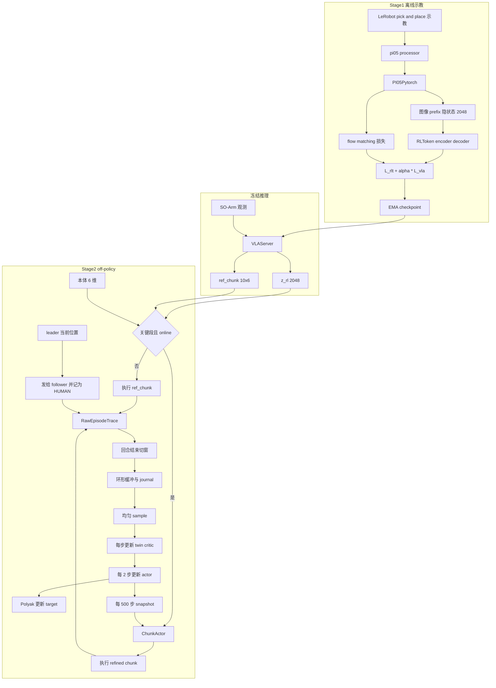
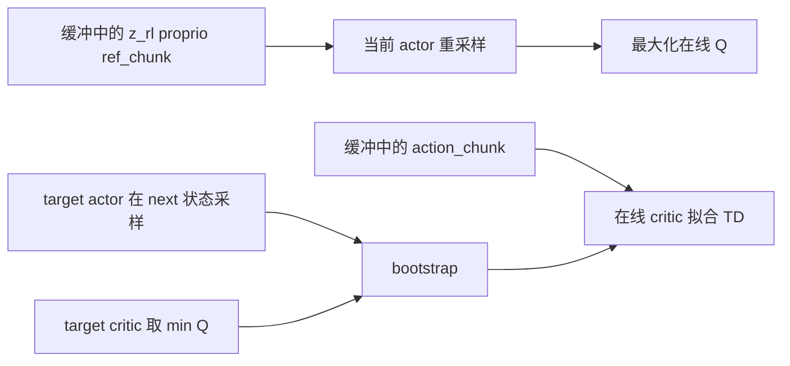

# SO-Arm Pick & Place：RLToken 代码开发计划

本文把 [RLtoken_dev_note.md](RLtoken_dev_note.md) 落成可以开工的文件清单。方法定义仍以那份笔记和 `openpi-RLT/questions.md` 为准。这里只回答三件事：新建哪些文件、每个文件写什么、按什么顺序做。

任务是 LeRobot 上的 SO-Arm 单臂 pick & place。默认硬件是 `so101_follower` + `so101_leader`。`so100_follower` / `so100_leader` 走同一套 `SOFollower` 类，只改机器人类型字符串。

## 1. 约束

不修改任何已有文件。不改 `modeling_pi05.py`、`factory.py`、`policies/__init__.py`、`lerobot_train.py`、`pyproject.toml`、`so_follower.py`。所有逻辑放在新文件里，通过调用已有公开接口完成。

因此和开发笔记第 7 节有一处落地差异：prefix 隐状态不往 `PI05Pytorch` 上加方法，而是在新模块里调用它已经存在的 `embed_prefix`、`paligemma_with_expert.forward`、`embed_suffix`、`denoise_step`。普通 `policy.type=pi05` 的训练和 `lerobot-rollout` 保持原样。

已有代码里可以直接用的钩子：

- `PreTrainedConfig.register_subclass` 在配置类被 import 时注册。`get_policy_class` 再按类名把 `configuration_rltoken` 换成 `modeling_rltoken`，加载 `RLTokenPolicy`。不必改 factory。
- 现有 `lerobot-train` 入口不会 import 新配置，所以 Stage 1 用新脚本：先 import 配置模块，再调用 `lerobot.scripts.lerobot_train.train`。
- `use_policy_training_preset=True` 时，优化器参数来自 `policy.get_optim_params()`。冻结 VLA 就在这个方法里只返回 RL-token 参数。
- 每个 optimizer step 之后，训练循环会调用策略上的 `update()`（见 `lerobot_train.py` 里对 `has_method(..., "update")` 的判断）。EMA 写在这个方法里。
- 数据采集用现有的 `lerobot-record`，不新写录制脚本。
- 机器人用 `make_robot_from_config` / `make_teleoperator_from_config`。动作字典用 `make_robot_action`。


## 2. Pick & place 任务约定

固定指令，语言不进 RL-token（`image_only=True`）。VLA 仍然看见这条指令，因为离散 state 和 task 写在 π0.5 的 prompt 里。

```text
task = "Pick up the cube and place it in the box."
```

本体顺序与 `SOFollower` 一致，共 6 维：

```text
shoulder_pan, shoulder_lift, elbow_flex, wrist_flex, wrist_roll, gripper
```

前 5 维相对当前 state，夹爪绝对。这由已有的 `use_relative_actions=true` 和 `relative_exclude_joints=["gripper"]` 完成。内部仍 pad 到 32 维。

相机默认两路：`front`（外部）和 `wrist`（腕部）。第三路不采集。配置里 `empty_cameras=1`，`PI05Config.validate_features` 会补上 `observation.images.empty_camera_0`。`PI05Policy._preprocess_images` 对缺失相机填 `-1` 并把 mask 置 0。RL-token 的重建损失使用这张图像 pad mask，空相机的 256 个 token 不进 MSE。


| 项                                   | 取值                                                |
| ----------------------------------- | ------------------------------------------------- |
| VLA `chunk_size` / `n_action_steps` | 50                                                |
| 在线 `chunk_len`                      | 10，只执行参考 chunk 的前 10 行                            |
| 控制频率                                | 10 Hz，可配置。10 行大约 1 秒                              |
| `z_rl`                              | 2048                                              |
| RL-token                            | 1 个 token，2 层，`embed_dim=input_dim=2048`          |
| 回合模式                                | `critical_phase`，从第一拍就算关键段                        |
| 成功                                  | 方块放进盒子后操作员按键。该 chunk 最后一拍奖励 1，其余为 0               |
| 复位                                  | 插值到 yaml 里的 6 维 home。home 用遥操作读一次真实姿态再填，不在代码里写死角度 |


Stage 1 没有奖励。Stage 2 的 warmup 执行 VLA 参考，online 之后关键段才走 actor。人类接管时读 leader 的 6 维位置。

## 3. 新文件一览

```text
src/lerobot/policies/rltoken/__init__.py
src/lerobot/policies/rltoken/configuration_rltoken.py
src/lerobot/policies/rltoken/rl_token.py
src/lerobot/policies/rltoken/prefix_adapter.py
src/lerobot/policies/rltoken/modeling_rltoken.py
src/lerobot/policies/rltoken/processor_rltoken.py

src/lerobot/rl/rltoken/__init__.py
src/lerobot/rl/rltoken/config.py
src/lerobot/rl/rltoken/networks.py
src/lerobot/rl/rltoken/action_representation.py
src/lerobot/rl/rltoken/replay.py
src/lerobot/rl/rltoken/trainer.py
src/lerobot/rl/rltoken/services.py
src/lerobot/rl/rltoken/rollout.py
src/lerobot/rl/rltoken/human_intervention.py
src/lerobot/rl/rltoken/configs/soarm_pick_place.yaml

src/lerobot/scripts/lerobot_train_rltoken.py
src/lerobot/scripts/lerobot_serve_rltoken.py
src/lerobot/scripts/lerobot_learn_rltoken.py
src/lerobot/scripts/lerobot_rollout_rltoken_soarm.py

tests/policies/rltoken/test_rl_token.py
tests/policies/rltoken/test_prefix_adapter.py
tests/policies/rltoken/test_modeling_rltoken.py
tests/rl/rltoken/test_networks.py
tests/rl/rltoken/test_action_representation.py
tests/rl/rltoken/test_replay.py
tests/rl/rltoken/test_trainer.py
tests/rl/rltoken/test_human_intervention.py
```

不往 `pyproject.toml` 加 console script。运行方式是 `python -m lerobot.scripts.<模块名>`。

## 4. 各文件写什么


### 4.1 `configuration_rltoken.py`

`RLTokenConfig(PI05Config)`，装饰器 `@PreTrainedConfig.register_subclass("rltoken")`。

类名必须以 `Config` 结尾。factory 会把它变成 `RLTokenPolicy`，并把本模块名中的 `configuration_` 换成 `modeling_`。

继承来的 π0.5 字段保持默认：`chunk_size=50`、`max_action_dim=32`、分位数归一化、`tokenizer_max_length=200`。本任务在训练命令里覆盖：

- `use_relative_actions=true`
- `relative_exclude_joints=["gripper"]`
- `empty_cameras=1`
- `dtype=bfloat16`

新增字段：

```text
num_rl_tokens = 1
num_layers = 2
embed_dim = 2048
input_dim = 2048
mlp_ratio = 4.0
num_heads = 8
dropout_rate = 0.0
image_only = True
rlt_alpha = 0.0
ema_decay = 0.99
pi05_pretrained_path = "lerobot/pi05_base"
```

`pi05_pretrained_path` 只在第一次构建时加载 VLA 权重。本策略自己的 `pretrained_path` 留给 RLToken checkpoint 的续训。两者不要混用，否则加载器会按 `RLTokenPolicy` 的键去读 π0.5 的权重。

`get_optim_params` 不放在配置里。优化器预设继续用父类的 AdamW + cosine decay。

### 4.2 `rl_token.py`

PyTorch 重写 `openpi-RLT/src/openpi/models/rl_token.py`，不调用 JAX。

- `RLTokenConfig` 用上面的超参，可以是一个普通 dataclass，由 `RLTokenConfig`（策略配置）填进来。为避免和策略配置同名，模块内叫 `RLTokenArchConfig`。
- `CrossAttentionLayer`：LayerNorm + 自注意力残差，LayerNorm + 交叉注意力残差，LayerNorm + GeGLU MLP 残差。`causal=False`。GeGLU 把线性层输出对半切开，一半做 GELU 门控。
- 正弦位置编码做成 `nn.Parameter`，初始化后可训练。
- `RLTokenEncoder`：输入 `[B, S, 2048]`，输出 `[B, num_rl_tokens, 2048]`。默认 `input_dim == embed_dim`，不建 input projection。
- `RLTokenDecoder`：query 长度等于目标序列长度，输出 `[B, S, 2048]`。
- `RLTokenModel.loss`：`target = prefix.detach()`，有 mask 时按有效 token 数乘 `input_dim` 做分母。返回标量 MSE 和 `{"mse": mse}`。
- `encode` 单独暴露，推理只用它。


### 4.3 `prefix_adapter.py`

只接收已经建好的 `PI05Pytorch`，不继承、不改它。从 `lerobot.policies.pi05.modeling_pi05` import `make_att_2d_masks`。

三个函数：

`extract_prefix_embeddings(model, images, img_masks, tokens, masks, image_only=True)`

1. `embed_prefix` 得到 prefix embedding 和 pad / attention mask。
2. 只把 prefix 送进 `model.paligemma_with_expert.forward(..., inputs_embeds=[prefix_embs, None], use_cache=False)`。
3. 返回值的第一项是最终层 prefix 隐状态，宽 2048。
4. `image_only` 时，图像 token 数 = `prefix_len - tokens.shape[1]`。语言 token 在后面，裁掉。语言仍然参与了这次 prefix 注意力。
5. 同步裁切 pad mask。

`compute_loss_with_prefix(model, images, img_masks, tokens, masks, actions, noise, time, image_only=True)`

把 `PI05Pytorch.forward` 里的张量拼接抄到这里，调用同一些子模块，这样 `rlt_alpha > 0` 时 prefix 只算一次。返回 `(per_element_mse, prefix_out, prefix_pad_mask)`。动作 MSE 的定义与现有 forward 相同：`x_t = t * noise + (1 - t) * actions`，`u_t = noise - actions`。现有 `forward` 仍只被普通 π0.5 使用，这里不调用它，因为它会丢掉 prefix 输出。

`sample_actions_with_prefix(model, images, img_masks, tokens, masks, noise=None, num_steps=None)`

1. `embed_prefix`。
2. `paligemma_with_expert.forward(..., inputs_embeds=[prefix_embs, None], use_cache=True)`，同时留下 `last_hidden_state` 和 KV cache。现有 `sample_actions` 把第一项写成了 `_`，所以不能靠调用它拿到隐状态。
3. 裁出图像 token 隐状态。
4. 用现有 `denoise_step` 做 10 步欧拉积分，`dt = -1 / num_steps`，起点是标准正态噪声。
5. 返回 `(actions, image_prefix_out, image_pad_mask)`。

`model.training` 为 False、且 `rlt_alpha == 0` 时，prefix 前向包在 `torch.no_grad()` 里。联合训练时不要包，动作损失需要梯度。重建分支另行 `detach`。

### 4.4 `modeling_rltoken.py`

`RLTokenPolicy(PreTrainedPolicy)`。

`__init__`：

- `self.pi05 = PI05Policy(config)`。`RLTokenConfig` 是 `PI05Config` 的子类，可以直接传。
- 若 `config.pi05_pretrained_path` 有值且不是在加载一份已经包含 RL-token 的 checkpoint，调用 `PI05Policy.from_pretrained`，把 `state_dict` 拷进 `self.pi05`。缺的 RL-token 键忽略，多余的 π0 键按 π0.5 现有的加载逻辑处理（这一步走 `PI05Policy` 自己的 `from_pretrained`，不重写它）。
- `self.rlt = RLTokenModel(...)`，随机初始化。
- `rlt_alpha == 0` 时：`self.pi05.requires_grad_(False)`，`self.pi05.eval()`。
- 建 EMA 影子权重，初始等于当前可训练参数。`ema_decay=0.99`。

`forward(batch)`：

1. `images, img_masks = self.pi05._preprocess_images(batch)`。
2. 读 `observation.language.tokens` 和 attention mask。
3. `actions = self.pi05.prepare_action(batch)`。
4. `rlt_alpha > 0` 时走 `compute_loss_with_prefix`，否则走 `extract_prefix_embeddings`。噪声和时间用 `self.pi05.model.sample_noise` / `sample_time`。
5. 动作损失裁到 `output_features[ACTION]` 的真实维，本任务是 6，再对 batch 取均值。
6. `rlt_loss = self.rlt.loss(prefix_out.detach(), image_pad_mask)`。
7. 总损失：`rlt_loss`，或 `rlt_loss + rlt_alpha * vla_loss`。
8. 返回 `(total, {"rlt_mse": ..., "vla_loss": ...})`。现有训练循环会把这个 dict 打进日志。

`get_optim_params`：

- `rlt_alpha == 0`：只返回 `self.rlt.parameters()`。
- `rlt_alpha > 0`：返回所有 `requires_grad` 的参数。

`update`：optimizer step 之后由现有训练循环调用。对可训练参数做 `ema = decay * ema + (1 - decay) * param`。

`infer_z_and_ref(batch)`：`eval` + `inference_mode`。调用 `sample_actions_with_prefix`，图像隐状态送进 `self.rlt.encode`，展平成 `[2048]`。动作裁回 6 维。这里返回的是模型空间里的动作；绝对关节由 processor 的 postprocess 做。推理服务加载 EMA 影子权重再调用这个方法。

`select_action` / `predict_action_chunk` 可以转给 `self.pi05`，供以后接到普通 rollout。本任务的在线循环不走动作队列，它用 `infer_z_and_ref`。

### 4.5 `processor_rltoken.py`

```text
def make_rltoken_pre_post_processors(config, dataset_stats=None):
    return make_pi05_pre_post_processors(config, dataset_stats)
```

factory 按策略名 `rltoken` 找这个函数名。预处理仍是：相对动作、分位数归一化、离散 state 写入 prompt、PaliGemma tokenize、图像缩到 224。后处理把动作反归一化并还原成绝对关节。

### 4.6 `policies/rltoken/__init__.py`

导出 `RLTokenConfig`、`RLTokenPolicy`、`make_rltoken_pre_post_processors`。训练脚本必须 import 配置模块，单靠这个包的存在不会被 `lerobot-train` 看到。

### 4.7 `scripts/lerobot_train_rltoken.py`

```text
import lerobot.policies.rltoken.configuration_rltoken  # 注册 rltoken
from lerobot.scripts.lerobot_train import train

def main():
    train()
```

import 必须发生在 `train()` 解析 `--policy.type` 之前。命令：

```bash
python -m lerobot.scripts.lerobot_train_rltoken \
  --dataset.repo_id=<user>/soarm_pick_place \
  --policy.type=rltoken \
  --policy.pi05_pretrained_path=lerobot/pi05_base \
  --policy.rlt_alpha=0 \
  --policy.use_relative_actions=true \
  --policy.empty_cameras=1 \
  --policy.dtype=bfloat16 \
  --policy.device=cuda \
  --batch_size=32 \
  --steps=5000
```

先跑 `rlt_alpha=0`。重建 MSE 下降之后，再用同一脚本把 `rlt_alpha` 设为 1 做联合训练。数据集若还没有分位数统计，先用现有的 `lerobot.scripts.augment_dataset_quantile_stats`，不新写统计脚本。

### 4.8 `rl/rltoken/config.py`

`SoarmPickPlaceConfig`，给在线阶段用。字段与开发笔记第 7.3 节一致，并写成 pick & place 的默认值：

```text
z_dim = 2048
proprio_dim = 6
action_dim = 6
gripper_index = 5
chunk_len = 10
fixed_std = 0.002
gamma = 0.99
warmup_bc_weight = 10
online_bc_weight = 5
q_weight = 0.1
delta_weight = 10
ref_dropout_prob = 0.5
actor_hidden_dim = 256
actor_num_layers = 2
critic_hidden_dim = 256
critic_num_layers = 2
actor_lr = 1e-4
critic_lr = 1e-4
actor_update_period = 2
target_tau = 0.005
warmup_min_size = 600
warmup_post_collect_updates = 20000
grad_updates_per_cycle = 5
push_actor_interval_steps = 500
checkpoint_interval_steps = 1000
replay_capacity = 200000
batch_size = 128
sample_strategy = "uniform"
step_trace_stride = 0
control_frequency_hz = 10
task = "Pick up the cube and place it in the box."
task_mode = "critical_phase"
enable_human_override = true
policy_resume_delay_sec = 1.0
home_pose = []          # 6 个数，由操作员填入
camera_keys = ["front", "wrist"]
```

相对维从 `gripper_index` 推导：除这一维之外都做相对量。不要把 `5` 写进惩罚函数的切片字面量。

服务地址：`vla_url`、`actor_url`、`replay_url`。learner 与 actor 同机。`ready_for_online` 用 HTTP，不读本地 `learner_status.json`。

### 4.9 `networks.py`

`ChunkActor`、`QNetwork`、`TwinCritic`，结构对齐 `openpi-RLT/rlt_online_rl/src/rlt_online_rl/networks.py`。

Actor 三支投影：`z_rl` 2048→256 后 LayerNorm；`proprio` 6→64 后 LayerNorm + tanh；`ref_chunk` 展平后→256 再 LayerNorm + tanh。拼接成 576，过 GELU MLP，输出 `[B, chunk_len, 6]` 的均值。标准差是常数 `fixed_std`。`deterministic=True` 时返回均值。

Critic 把第三支换成动作 chunk，trunk 输出标量。两个 Q 独立初始化。Critic 的 forward 签名里没有 `ref_chunk`。

`apply_reference_dropout`：按 batch 把整段 `ref_chunk` 乘 0，概率 0.5。只在训练时调用。

### 4.10 `action_representation.py`

输入输出都是绝对关节。

- `abs_to_delta(chunk, proprio)`：`gripper_index` 以外的维减去 proprio，夹爪原样保留。
- `delta_to_abs`：反向加回。
- `normalize` / `denormalize`：q01/q99。统计文件从 Stage 1 数据集的 quantile stats 导出，路径写在 yaml 的 `action_norm_stats_path`。不要使用 Agilex 的统计。
- `prepare_training_batch`：把缓冲里的绝对 `action_chunk`、`ref_chunk`、`next_ref_chunk` 转成归一化 delta。
- `step_delta(abs_chunk)`：`chunk[:, 1:, :gripper_index] - chunk[:, :-1, :gripper_index]`，给 `delta_penalty` 用。夹爪不进这项。


### 4.11 `replay.py`

`TransitionSource`：`BASE=0, RL=1, HUMAN=2, MIXED=3`。

`RLTTransition` 字段：

```text
z_rl, proprio, ref_chunk, action_chunk, rewards, done,
next_z_rl, next_proprio, next_ref_chunk,
source, source_chunk, collection_phase, success,
intervention_flag, episode_id, step_id
```

`ReplayBuffer`：环形，容量 200000。第一条样本决定形状。`z_rl` 和三个 chunk 用 float16 存，采样时转 float32。`proprio`、`rewards` 用 float32。`size = min(写入次数, capacity)`，满了覆盖最老槽。`adds_total` 覆盖时也加。`sample` 在 `[0, size)` 上有放回地均匀抽。

`ReplayJournal`：每次 `add` 后追加 pickle。启动时重放。条数超过容量时，缓冲只留最后 `capacity` 条，`adds_total` 等于日志总条数。

`build_transitions(trace, chunk_len)`：只在回合结束后调用。窗口长度 `chunk_len`。非关键段（`drop_transition`）断开，不能跨段配对 `z_rl` 和 `next_z_rl`。尾巴丢掉。缺特征的锚点由调用方在切窗前补完。

### 4.12 `trainer.py`

`train_step` 的顺序：

1. `prepare_training_batch`。
2. 两个 Q 对 TD 目标做 MSE。目标是 chunk 内折扣奖励之和，加上 `(1 - done) * gamma ** chunk_len * min(next_q1, next_q2)`。下一步动作来自 target actor 的随机采样，不来自缓冲里的旧动作。
3. 每 `actor_update_period` 步更新 actor，再 Polyak 更新 target，`tau=0.005`。
4. Actor 损失：

```text
human = (source_chunk == HUMAN) | (source_chunk == MIXED)
bc_target = where(human, executed_chunk, ref_chunk)
actor_loss = bc_weight * mse(pred, bc_target)
            - q_weight * q1
            + delta_weight * mse(pred_step_delta, target_step_delta)
```

BC 目标用 dropout 之前的 `ref_chunk`。`pred` 是当前 actor 在 dropout 之后的输入上重采样的新 chunk。实现以 openpi 的 `trainer.update_actor` 为准，不要用 `networks.compute_actor_loss`：后者只把预测拉向 `ref_chunk`，没有按 `source_chunk` 切换人类目标，也没有关节增量项。第 8 节写清这条 off-policy 更新。

`Learner`：

- `replay.size < warmup_min_size` 时空转。
- 先做完 `warmup_post_collect_updates`，此阶段 `bc_weight=10`。
- 之后每新增 1 条 `adds_total`，做 `grad_updates_per_cycle` 次更新，`bc_weight=5`。
- 每 500 步原子写入 `actor_snapshot.pt`。
- 每 1000 步保存 actor、critic、target、优化器。
- 提供 `GET /status`，返回 `ready_for_online` 和 actor 版本。

VLA 和 RL-token 不进这个优化器。

### 4.13 `services.py`

三个服务，都是新代码，协议用 HTTP + JSON（图像用 base64 或原始字节字段）。不改 openpi 的 WebSocket 服务器。

`VLAServer`：加载 Stage 1 的 EMA checkpoint 和 `make_rltoken_pre_post_processors`。请求是一帧 LeRobot 观测（6 维 state、两路图像、task）。响应是 `z_rl [2048]` 和模型后处理之后的绝对 `ref_chunk [50, 6]`。客户端再裁到 `chunk_len`。`proprio` 不采用服务端回传值。

`ActorServer`：请求 `z_rl / proprio / ref_chunk`。内部做 delta 归一化、`ChunkActor`、反变换。没有 snapshot 或推理失败时返回原始 `ref_chunk`，`source=BASE`。每 0.25 秒看一次 snapshot 文件。训练 rollout `deterministic=false`，eval 为 true。

`ReplayServer`：`POST /extend`、`POST /sample`、`GET /stats`。与 learner 的采样都打到这个进程的内存缓冲。

### 4.14 `rollout.py`

`PickPlaceRollout`。机器人用 `make_robot_from_config`，leader 用 `make_teleoperator_from_config`。不写 ROS，不改 `SOFollower`。

一个控制拍：

1. `robot.get_observation()`，把 6 个 `*.pos` 按第 2 节的顺序拼成 `state`，带上 `front` / `wrist` 和固定 task。
2. chunk 用完，或人类刚刚交还控制时，才请求 VLA。`proprio` 用本机 state。`ref_chunk` 裁成 `[10, 6]`。
3. 阶段不是 online，或本回合锁定 base 时，执行 `ref_chunk`，`source=BASE`。否则请求 actor。
4. 一行动作用 `make_robot_action` 变成 `{motor}.pos`，再 `robot.send_action`。
5. 睡眠补到 `1 / control_frequency_hz`。然后重新读观测。
6. 接管走第 4.18 节。策略关闭期间不发送 actor 剩余行，改为按同一节拍读 leader，把该 6 维位置发给 follower，并记为 `source=HUMAN`。同一窗口里既有策略步又有人类步则为 `MIXED`。

回合开始前把 follower 插值到 `home_pose`。键盘与本进程在一起：下一回合、成功、失败、切换人类介入、本回合强制 base。成功只把当前已执行步的最后一拍奖励设为 1。

20 Hz 或 10 Hz 的节拍不写 replay。回合结束后：原始 trace 落盘，缺的 `z_rl` / `ref_chunk` 再向 VLA 补，然后 `build_transitions`，再 `POST /extend`。

`Phase`：`warmup_collect` → `warmup_wait_online` → `online`。切换只发生在回合之间。`warmup_wait_online` 轮询 learner 的 `/status`。

### 4.15 `configs/soarm_pick_place.yaml`

把第 4.8 节的默认值写成一份文件。`home_pose` 留空列表，启动时若长度不是 6 就退出并提示先遥操作读一次姿态。`action_norm_stats_path` 指向 Stage 1 数据集的分位数统计。`enable_human_override` 必须为 true。openpi Ethernet 的 yaml 里这项是 false，那只是那次实验关掉了接管；本任务的 pick & place 要保留 RLToken 的人类介入采集，不能跟着关掉。

### 4.16 在线脚本

`lerobot_serve_rltoken.py`：解析 checkpoint 和端口，启动 `VLAServer`。

`lerobot_learn_rltoken.py`：按 yaml 启动 `ReplayServer`、`Learner`、`ActorServer`。三者都在 GPU 机器上。actor 与 learner 共用本地 snapshot 目录。

`lerobot_rollout_rltoken_soarm.py`：解析机器人端口、相机和三个 URL，启动 `PickPlaceRollout`。eval 模式把 replay 客户端换成空实现，actor 用均值。

### 4.17 测试

全部是新文件，用 CPU 上的小张量，不连真机，也不加载 `lerobot/pi05_base`。

- `test_rl_token.py`：encode / decode 形状，mask 分母，`detach` 之后 VLA 张量没有梯度。
- `test_prefix_adapter.py`：用随机权重的 `PI05Pytorch` 检查图像 token 数等于 prefix 长度减 200，空相机 mask 为 False。`compute_loss_with_prefix` 在同一噪声、同一时间上与 `PI05Pytorch.forward` 的动作 MSE 一致。
- `test_modeling_rltoken.py`：`rlt_alpha=0` 时 π0.5 参数无梯度；只反传重建损失时 π0.5 无梯度；`rlt_alpha=1` 时总损失等于两项之和，只反传动作损失时 π0.5 有梯度。
- `test_networks.py`：均值形状 `[B, 10, 6]`，标准差恒为 `fixed_std`。
- `test_action_representation.py`：夹爪维在 delta 变换中不变；`step_delta` 不含第 6 维。
- `test_replay.py`：满容量后覆盖最老样本，`adds_total` 继续增加；日志重放之后 `adds_total` 等于日志条数。
- `test_trainer.py`：全 `BASE` 时 BC 目标是 `ref_chunk`；改成 `HUMAN` 后目标变成执行动作。TD 目标公式与第 4.12 节一致。
- `test_human_intervention.py`：见第 4.18 节。假 leader 的位置必须出现在 trace 的执行动作里，并且窗口的 `source_chunk` 与 `intervention_flag` 一致。

### 4.18 人类介入的数据收集

在线 RL 的样本里要有人类修正。openpi 在 `PikaChunkEnvAdapter.execute_chunk` 里做这件事：策略打开时按行发 chunk；操作员切到遥操作后，控制环不再发 actor 的剩余行，而是按控制周期采样遥操作命令，写入同一步 trace。SO-Arm 没有那条 ROS 命令话题，采集改到 leader 上，语义保持不变。

新文件 `src/lerobot/rl/rltoken/human_intervention.py`，由 `PickPlaceRollout` 持有。不改 `SOFollower` 和 `SOLeader`。

`InterventionState`：

- `policy_enabled` 默认 true。
- 键盘一键切换。切回策略时进入 `policy_resume_delay_sec`（默认 1 秒）的冷却。冷却期间仍视为人类控制，避免松手的瞬间就把 actor 的旧 chunk 发出去。
- 回合结束或复位时回到 `policy_enabled=true`，并清掉当前 plan。
- `enable_human_override=false` 时切换无效。本任务的 yaml 把这项设为 true。

`LeaderActionSource`：

- 每个控制拍调用 leader 的 `get_action()`，得到 6 个 `{motor}.pos`。
- 按第 2 节的关节顺序拼成 6 维绝对位置。这就是本拍要执行、也要写入 trace 的动作。
- leader 还没有读数时，用 follower 当前 `state` 的前 6 维，避免写出空动作。
- 读到的位置立刻 `robot.send_action`。LeRobot 的 leader 不会自己驱动 follower，所以必须由 rollout 转发。openpi 里遥操作已经在往命令话题发，控制环只采样；这里采样和转发是同一步。

控制拍在策略关闭或仍处于冷却时：

1. 丢掉当前 `action_chunk` 和 `plan_cursor`。剩下的 actor 行不再发出。
2. 采样 leader，发给 follower，记入 `executed`。
3. 这一拍的 `source=HUMAN`，`human_controlled=true`，`actor_param_version=-1`。
4. 逐步 `ref_action` 记本拍实际执行的人类动作，供 trace 对齐。窗口级的 `ref_chunk` 仍然是该窗口起点上 VLA 的参考，供 actor 输入和 `BASE` / `RL` 拍的行为克隆使用。人类拍的行为克隆目标是 `action_chunk` 里的执行动作，不是这个 `ref_chunk`。

交还控制、冷却结束后的下一拍：

- 当前 plan 已空，所以重新向 VLA 要 `z_rl` 和 `ref_chunk`，再按阶段决定走 actor 还是参考。
- 这一拍是新的策略锚点，写入 `policy_start_steps`。切窗时它和 chunk 起点一样可以成为窗口起点，人类段和策略段不会拼进同一个错误的 `(z_rl, next_z_rl)`。

一个执行窗口的 `source`：全是人类拍则为 `HUMAN`；既有策略拍又有人类拍则为 `MIXED`；没有人类拍则沿用原来的 `BASE` 或 `RL`。`intervention_flag` 在任一拍为人类时为 true，并写入 `RLTTransition`。

warmup 也允许接管。接管拍的 source 仍是 `HUMAN`，不是 `BASE`。这样缓冲里的人类修正和 VLA 参考是两种行为，BC 才能按拍选择目标。

eval 可以接管以便安全停住机器人，但 `NullReplayClient` 不把这些步写入缓冲。

`test_human_intervention.py` 用假 follower 和假 leader，不连串口：

1. 策略打开时，发出的动作等于 plan 的下一行，leader 的位置不进 trace。
2. 切换到人类后，随后两拍发给 follower 的动作等于假 leader 的位置，trace 里这两拍 `source=HUMAN`，plan 的剩余行没有发出。
3. 切回策略并过完冷却后的下一拍会再次调用 VLA，而不是把旧 chunk 的下一行发出去。
4. 10 拍里前 4 拍是策略、后 6 拍是人类时，窗口 `source=MIXED`，`intervention_flag=true`，`source_chunk` 前 4 个是 `RL` 或 `BASE`、后 6 个是 `HUMAN`。对应的 BC 目标只有后 6 拍等于执行动作。


## 5. 开发步骤

每一步只加新文件。前一步的测试通过后再做下一步。

### 步骤 A：prefix 适配和 RL-token

新建 `rl_token.py`、`prefix_adapter.py` 和对应测试。

验收：图像 token 形状 `[B, num_image_tokens, 2048]`。两路真实相机加一路空相机时，token 数是 768，空相机那 256 个位置 mask 为 False。`compute_loss_with_prefix` 的动作 MSE 与 `PI05Pytorch.forward` 对齐。重建目标 `detach`。

### 步骤 B：策略类和 Stage 1 入口

新建 `configuration_rltoken.py`、`modeling_rltoken.py`、`processor_rltoken.py`、`__init__.py`、`lerobot_train_rltoken.py`、`test_modeling_rltoken.py`。

用 `lerobot-record` 采 pick & place 示教。确认一条样本里有 6 维 `observation.state`、6 维 `action`、`observation.images.front`、`observation.images.wrist`，task 字符串就是第 2 节那句。补齐分位数统计。

先 `rlt_alpha=0` 训练。MSE 下降后保存 checkpoint，再开 `rlt_alpha=1`。

验收：开发笔记第 4.4 节的六条。另外，`python -m lerobot.scripts.lerobot_train --policy.type=rltoken` 可以失败，这是预期的，因为没有改 `policies/__init__.py`。新脚本必须能解析 `rltoken`。

### 步骤 C：冻结推理服务

新建 `services.py` 里的 `VLAServer` 和 `lerobot_serve_rltoken.py`。

用数据集里的一帧请求服务。比较两种路径的 `z_rl`：服务内部的 shared prefix，以及先 `extract_prefix_embeddings` 再单独采样。二者在 bfloat16 容差内一致。返回的 `ref_chunk` 最后一维是 6，并且已经是绝对关节。

### 步骤 D：actor、critic、replay、learner

新建 `rl/rltoken/` 下除 `rollout.py` 以外的文件，以及 `lerobot_learn_rltoken.py` 和 `tests/rl/rltoken/`。

用步骤 C 把几十条假轨迹做成 `RLTTransition`，不连机器人，只跑 learner。

验收：开发笔记第 5.5 节。夹爪不进 `delta_penalty`。learner `/status` 在 warmup 更新做完后返回 `ready_for_online=true`。

### 步骤 E：真机闭环

新建 `rollout.py`、`lerobot_rollout_rltoken_soarm.py`，填好 yaml 里的 home、端口和相机。

GPU 机器上先起 VLA 服务和 learner。机器人机器上复位到 home，再开始回合。warmup 的执行动作等于 `ref_chunk`，source 全是 `BASE`。缓冲超过 600 且 `/status` 允许 online 之后，下一回合才走 actor。拔掉 actor 时退回 `ref_chunk`，回合不中断。接管时不发送 actor 的剩余行。成功奖励只在最后一拍。

eval 不写 replay，actor 用均值。同一套键盘介入仍然可用，但 eval 不把这些步写入 replay。

人类介入不是可选注释。步骤 E 必须能在假 leader 上跑通第 4.18 节：切换后 follower 收到的是 leader 位置，交还后的下一拍重新向 VLA 要特征，切出的 transition 里人类拍的 BC 目标是执行动作。

## 6. 机器怎么分

GPU 机器跑 VLA 服务、replay、learner、actor。机器人机器只跑 `lerobot_rollout_rltoken_soarm`。snapshot 留在 GPU 机器本地，不为它做网络协议。`ready_for_online` 走 learner 的 `/status`。带图像的原始回合留在机器人机器，在线训练不读它。

## 7. 这一阶段明确不写的东西

- 不改 π0.5 的 flow matching、tokenizer 和 robot 类。
- 不把 SAC、`GaussianActorPolicy` 或带图像的 `ReplayBuffer` 接进这条链路。
- 不在 Stage 2 更新 VLA 或 RL-token。
- 不写 PPO、熵正则或 importance weight。
- 不把第三路真实相机、20 Hz、7 维动作写进默认配置。

## 8. Stage 2：off-policy chunk actor-critic

本节补在第 7 节之后。Stage 1 结束时，VLA 和 RL-token 已经冻结。Stage 2 只训练 chunk actor、twin critic 和它们的 target 网络。算法对齐 `openpi-RLT/rlt_online_rl/src/rlt_online_rl/trainer.py` 的 `update_critic` / `update_actor` / `train_step`，以及 `questions.md` 第 2.3、4、5 节。SO-Arm 只改动作维和硬件边界。

### 8.1 为什么这是 off-policy

动作单位是一整段 `chunk_len=10` 的关节目标，不是单步。它和 SAC、TD3 同一族：双 Q、target 网络做 Polyak 平均、actor 用重参数化高斯采样再对 Q 求梯度。和标准 SAC 的差别是标准差固定为 `0.002`，损失里没有熵项，另外加了行为克隆和关节增量惩罚。没有 PPO 的 clip，没有 GAE，也没有行为策略的 importance weight。

判定依据是：产生样本的行为策略，和正在被更新的 actor，不是同一个分布，而且更新时不把旧样本丢掉。

行为策略是混合的。

- warmup 执行冻结 VLA 的 `ref_chunk`，`source=BASE`。
- online 关键段执行当时的 actor，`source=RL`。snapshot 每 500 个梯度步才发布一次，缓冲里还留着更早版本 actor 的样本。
- 人类接管的步是 `HUMAN`。一个窗口里既有策略步又有人类步，则该拍为 `MIXED`。

`sample_strategy=uniform` 时，`ReplayBuffer.sample` 在 `[0, size)` 上有放回地抽下标。warmup 的 VLA 数据、旧 actor 的数据和刚写入的新回合进同一个 batch。

Critic 的贝尔曼备份也是 off-policy 的写法。当前 Q 回归缓冲里存下来的 `action_chunk`，也就是当时行为策略真正执行的动作。bootstrap 的下一步动作从 **target actor** 重新采样，不沿用采集时的动作，也不乘行为策略的概率比。

Actor 更新站在 replay 的状态分布上：给定缓冲里的 `(z_rl, proprio, ref_chunk)`，从**当前** actor 重参数化采样一个新 chunk，再最大化 Q。状态来自旧策略，动作来自新策略。同一条 transition 会被反复使用：warmup 后先做 20000 次更新，之后每新增 1 条再做 5 次梯度。环形缓冲容量 200000，旧数据留到被覆盖。

数据先落盘不改变这个划分。on-policy 需要当前策略当场产出轨迹，用该轨迹的对数概率或比率做一次更新，然后丢弃。这里保留混合行为策略的 transition，并在这些状态上评估另一个 actor。journal 只是让这批数据在进程重启后还在。

### 8.2 一次梯度步

`train_step` 每个 learner step 都先更新 critic。`(global_step + 1) % actor_update_period == 0` 时才更新 actor，并立刻软更新两套 target。`actor_update_period=2`，所以 critic 比 actor 密一倍。target 的 `tau=0.005`：

```text
target = (1 - tau) * target + tau * online
```

Critic 损失是两个 Q 对同一 TD 目标的 MSE。TD 目标：

```text
next_action = target_actor.sample(next_z_rl, next_proprio, next_ref_chunk, deterministic=False)
next_q = min(target_q1, target_q2)
discounted = sum_k gamma^k * rewards[k]
bootstrap = (1 - done) * (gamma ** chunk_len) * next_q
td_target = discounted + bootstrap
```

`rewards` 的形状是 `[chunk_len]`。`done=1` 时 bootstrap 为 0。Actor 最大化 Q 时用的是**在线** critic 的 `q1`，不是 target critic。

Actor 前向：

1. 以概率 `ref_dropout_prob=0.5` 把整段 `ref_chunk` 乘 0。这只改 actor 的输入。推理和 eval 的概率为 0。
2. 从当前 actor 采样 `pred = mu + fixed_std * noise`。
3. 按时间步选 BC 目标。`HUMAN` 和 `MIXED` 用缓冲里的执行动作，`BASE` 和 `RL` 用 dropout 之前的 `ref_chunk`。部署时 actor 看到的永远是 VLA 参考，所以人类数据教的是“怎样把 VLA 参考改成人类修正”。

```text
human = (source_chunk == HUMAN) | (source_chunk == MIXED)
bc_target = where(human, action_chunk, ref_chunk)
bc_penalty = mean(square(pred - bc_target))
```

日志里再分开记 `bc_ref_penalty` 和 `bc_human_penalty`，分母是对应 mask 的步数，避免某一类步数为 0 时除零。

关节增量惩罚在反归一化之后的绝对关节上计算，并且只比较夹爪之前的维。SO-Arm 的 `gripper_index=5`，所以切片是 `:5`，不是 openpi Ethernet 里写死的 `:6`。

```text
pred_abs = denormalize_to_abs(pred, proprio)
target_abs = denormalize_to_abs(bc_target, proprio)
pred_step = pred_abs[:, 1:, :gripper_index] - pred_abs[:, :-1, :gripper_index]
target_step = target_abs[:, 1:, :gripper_index] - target_abs[:, :-1, :gripper_index]
delta_penalty = mean(square(pred_step - target_step))
actor_loss = bc_weight * bc_penalty - q_weight * mean(q1) + delta_weight * delta_penalty
```

warmup 预算没用完时 `bc_weight=10`，`q_weight=0.1`。进入 online 预算后 `bc_weight=5`，`q_weight` 仍是 0.1。`delta_weight=10` 全程不变。两个优化器都是 Adam，学习率 `1e-4`，互不共享状态。

`prepare_training_batch` 发生在 `train_step` 之前。缓冲里存的是绝对关节。采样后把 `action_chunk`、`ref_chunk`、`next_ref_chunk` 变成归一化的 `delta_chunk`：夹爪之前的维减去窗口起点的 proprio，夹爪保持绝对，再做 q01/q99。统计来自 Stage 1 同一份示教的分位数，按这个 5+1 的定义导出。Actor 的输出在执行前走反向变换。

### 8.3 样本从哪来，什么时候读写

控制环的 10 Hz 节拍不写缓冲。每拍只往机器人进程里的 `RawEpisodeTrace` 追加：该拍开始时的观测、实际发出的 6 维动作、对应的参考动作、奖励、下一观测、是否人类控制、source、actor 参数版本、done。人类拍的执行动作来自第 4.18 节的 leader 采样，不是 actor 的剩余行，也不是事后从别的数据集补进去的。

缓冲的唯一在线写入点是回合结束，顺序固定：

1. 原始 trace 先落成 `episodes/episode_XXXXXX.pkl`。切窗仍用内存里的 trace，不把刚写的文件读回来。
2. `step_trace_stride=0` 时按 chunk 边界切窗。窗口锚点是：每个未丢弃 chunk 的起点、人类交还控制后策略重新开始的那一拍、终止步对齐的最后一个满窗口。窗口长度 10。不够长的尾巴丢掉。`drop_transition` 的非关键段跳过，轨迹在这里断开。
3. 窗口起点或终点没有缓存的 `z_rl` / `ref_chunk` 时，机器人已经停下之后再向 VLA 服务补，按 16 条一批。因此 transition 里的 `ref_chunk` 是该观测上 VLA 的参考，`action_chunk` 是这 10 拍真正执行的动作。
4. `POST /extend`。replay 进程在同一临界区内先写入环形缓冲，再把同一批记录追加到 `replay_journal.pkl`，然后 `flush` 和 `fsync`。

learner 的每个 batch 只打 `POST /sample`。服务端在已经驻留内存的缓冲上抽下标，不打开 journal，也不打开 `episodes/*.pkl`。抽样不删除槽位。原始回合含图像，learner 的输入里没有图像键，在线训练用的是已经算好的 `z_rl`。

四份存储的职责：

| 存储 | 内容 | 谁在在线循环里读 |
| --- | --- | --- |
| 回合内存 `RawEpisodeTrace` | 本回合逐步观测、动作、奖励 | 只在回合结束时切窗，随后丢弃 |
| 环形缓冲 | 最近 `capacity` 条 `RLTTransition` | learner 的 `sample`，rollout 的 `stats` |
| `replay_journal.pkl` | 历史上每一次 add，不随覆盖删除 | 只在 replay 进程启动时重放 |
| `episodes/*.pkl` | 带图像的整段 trace | 在线 learner 不读 |

四个计数不要混用。`capacity` 配置后不变。`size` 是当前可抽样条数，warmup 门槛 600 看它。`position` 是下一笔写入下标，对容量取模。`adds_total` 是累计写入次数，覆盖旧槽也继续增加。梯度预算用 `adds_total`，不用 `size`。重启后 `adds_total` 等于 journal 总条数，可以大于 `size`。

未满时新数据写在 `[0, size)`。满了之后 `size` 停在 200000，新数据覆盖最老槽。没有优先级，没有单条删除，也没有用过就弹出。

### 8.4 回合阶段和梯度预算

阶段只在回合之间切换。

1. `warmup_collect`：`size < 600`。执行 VLA 参考，`source=BASE`。learner 空转。
2. `warmup_wait_online`：条数已够，但 `ready_for_online` 还是 false。机器人继续执行 VLA，直到 learner 做完 20000 次 warmup 更新，并且 actor 版本不低于 `push_actor_interval_steps / actor_update_period = 250`。
3. `online`：下一回合开始后，关键段才把 chunk 交给 actor，`source=RL`。

`ready_for_online` 由 learner 的 `GET /status` 给出。机器人机器不读 GPU 机器上的本地 json。

warmup 的 20000 次做完之后，每增加 1 条 `adds_total`，再允许 5 次梯度。预算用尽就等待新回合。learner 与机器人并行：上一个回合的 transition 进缓冲之后，下一个回合还在采集时，learner 继续 `sample`。

`task_mode=critical_phase` 时，pick & place 从第一拍就处于关键段。若改成 `full_task`，关键段之前的 chunk 标 `drop_transition`，不进 replay。

奖励不是环境自动算的。操作员标记成功时，本 chunk 已执行步的最后一拍为 1，其余为 0。失败只结束回合，不给正奖励。

### 8.5 参数怎样回到机器人

learner 每 500 个梯度步把 actor 参数原子写成 `actor_snapshot.pt`，历史版本另存。actor 服务每 0.25 秒看这个文件，版本变了就热加载。下一次 `/infer` 使用新参数，并把 `actor_param_version` 写回逐步 trace。每 1000 步另存 actor、critic、target 和优化器，重启可恢复。

没有 snapshot，或 actor RPC 失败且 `safe_fallback_to_ref=true` 时，执行 VLA 参考，`source=BASE`。eval 仍走 VLA 和 actor，actor 用均值，replay 客户端是空实现。

VLA checkpoint 在整个 Stage 2 中不加载进优化器，权重哈希保持不变。

### 8.6 Stage 2 要补的测试

在第 4.17 节之外再加这些断言，仍用 CPU 小张量：

- 全 `BASE` 的一步，BC 目标等于 dropout 之前的 `ref_chunk`。把其中两拍改成 `HUMAN` 后，只有这两拍的目标变成执行动作。
- `ref_dropout` 把输入参考乘 0 之后，BC 目标仍然是原来的 `ref_chunk`。
- `delta_penalty` 在绝对关节上计算。只改夹爪维时这项不变。切片长度是 `gripper_index`，不是 6。
- critic 每步都有梯度。`actor_update_period=2` 时，奇数步 actor 参数不变，偶数步 actor 和两套 target 都变。
- TD 目标等于折扣奖励加 `(1 - done) * gamma ** 10 * min(target_q1, target_q2)`。bootstrap 动作来自 target actor 的新采样。
- 缓冲里同时有 `BASE` 和 `RL` 样本时，一次 `sample` 可以抽到两种 source。不存在按采集策略概率做的重加权。
- `adds_total` 增加 1 之后，剩余梯度预算增加 5。`size` 停在容量时，`adds_total` 仍增加。

## 9. 完整训练与在线强化学习框架

Stage 1 用示教把 π0.5 和 RL-token 训完。Stage 2 冻结这两者，只用在线 transition 更新 actor 和 critic。



一次在线更新里，谁提供状态、谁提供动作：



Stage 1 的梯度只在示教 batch 上产生。`rlt_alpha=0` 时梯度只进 RL-token；`rlt_alpha>0` 时 VLA 的梯度只来自 flow matching，重建项始终 `detach`。Stage 2 的梯度只进 actor 和 critic。机器人上的下一回合通过 snapshot 用到新 actor，不重载 VLA。

